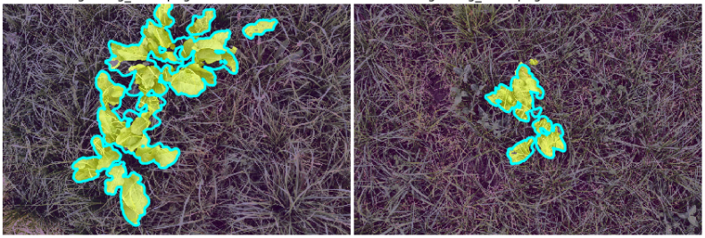
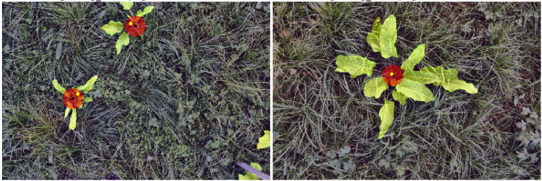

# UNet for Rumex Obtusifolius segmentation and root-detection in 2D field-images



Leaf Prediction: Yellow Mask, Ground Truth: Cyan Border



Root Prediction: Black Point, Ground Truth: Yellow Point

#### Required Packages:
- tensorflow
- keras
- pandas
- numpy
- imgaug
- seaborn
- skimage
- pil
- sklearn
- matplotlib
- cv2
- imutils
 
 # [Notebooks:](notebooks/)
 * [10_inspect_data](notebooks/10_inspect_data.ipynb) Resizies the images from "LabelingTool" in in same sizes including the labels (mask, root-centers, leaf-splines)
 * [20_training](notebooks/20_training.ipynb) Training Process of the Unet
 * [30_results](notebooks/30_results.ipynb) Visualize the optical Results and Evaluate both Segmentation and Root-Detection
 * [40_layer_visualization](notebooks/40_layer_visualization.ipynb) Visualize the intermediate Layers of the trained Network
 * [50_weights_visualization](notebooks/50_weights_visualization.ipynb) Visualize the weights of the Convolution-Kernels of both trained and untrained model


# [UNet:](unet/)
* [unet](unet/unet.py) Unet Class for creating both untrained and pretrained Unet with VGG19 Encoder
* [data_generator](unet/data_generator.py) Keras Sequence Data Generator to feed the data batchwise to the network and applying prepropressing and data augmentation in parallel on cpu while training
* [losses](unet/losses.py) Loss Functions for training

# [Utils:](utils/)
* [tools](utils/tools.py) Visualization and Evaluation Tool: [tools-readme](utils/)
* [config](utils/config.py) Config File
* [utils](utils/utils.py) Various util functions

# [Rumex Tools:](rumex_tools.py)
Class to simply get the leaf segmentation or root coordinates for an image.
Example for usage:

```python
# Note: 
- Model0 must be taken as the Model
- Input image must be a 3Channel RGB image with Ratio ~3:2
rd = Rumex_Detection(model_path="Path to Model0")

# To get the leaf segmentation (as binary image) of an image:
img = rd.get_leaf_mask(image)

# To get the root coordinates (as list of tuples (X,Y)) of an image:
root_coordinates = rd.get_root_coords(image)

```
